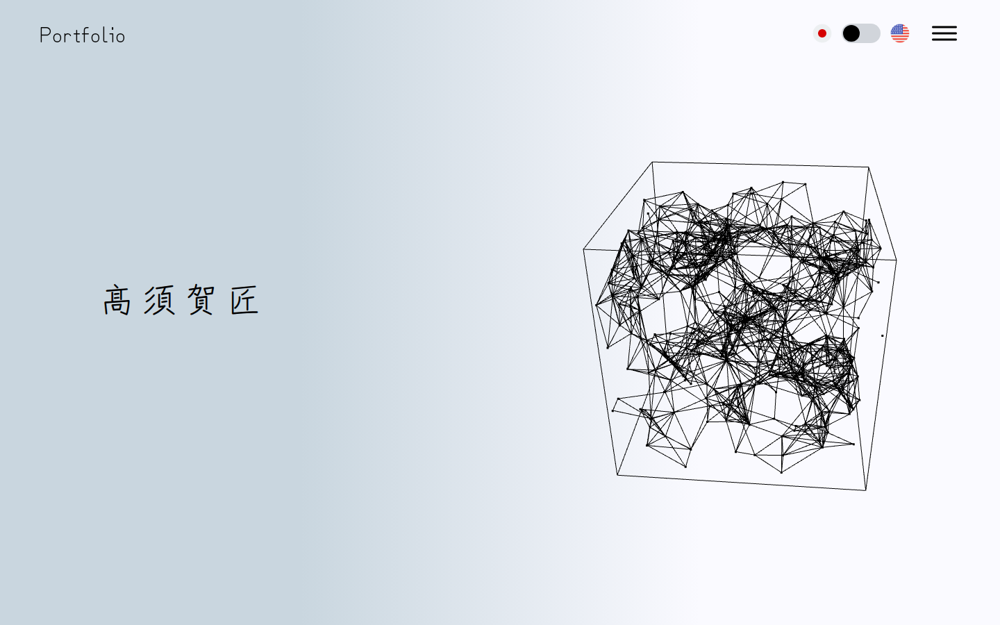
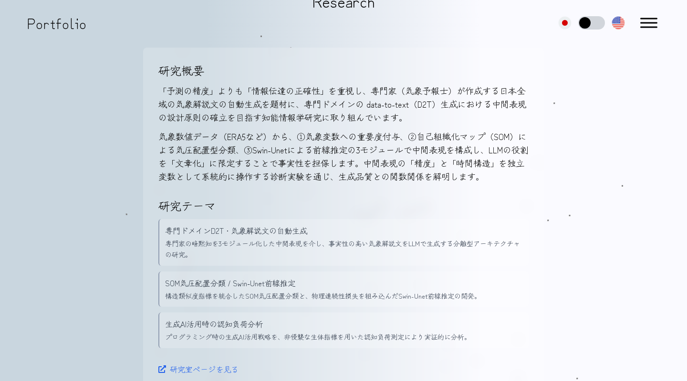
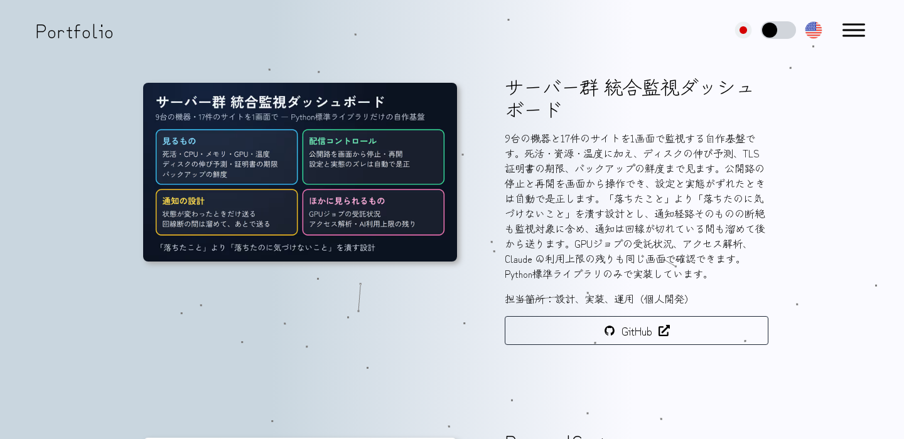

# Portfolio のデザイン

最終更新：2026-10-10。このサイトの見た目はデザイナーが作ったもので、全体にまとまりがあります。
**新しい要素を足すときは、この文書の値から選び、新しい色・角丸・影・面を増やさないでください。**

| トップ | 研究（薄い面） | 作品（囲まない） |
|---|---|---|
|  |  |  |

---

## 1. 方針

1. **主役は背景と 3D の立方体。** 淡いグラデーションの背景に、線で描いた立方体と粒。部品はそれを隠さない。
2. **囲みは最小限。** 作品は囲まずに背景へ直接置く。囲むときは「白20%＋ぼかし」の薄い面だけ（背景が透ける）。
3. **手書き風の書体で、色は黒。** Zen Kurenaido と黒い字。色はほとんど使わない（リンクの青と、紺の細い線だけ）。
4. **影は画像に1種類。** 作品・論文の画像だけに、右下にずれた影（`shadow-custom`）。
5. **ボタンは細い枠の1種類。**

---

## 2. 変えないもの

- 背景：`linear-gradient(to right, #c9d6df 30%, #fafaff 70%)`（`app/[lang]/globals.css`）
- トップの 3D の立方体と背景の粒（`app/components/hero/HeroCube.tsx`・`app/components/layouts/BackAnimation.tsx`）
- 書体：Zen Kurenaido（`app/layout.tsx` の `next/font`、Tailwind の `font-zenKurenaido`）
- ヘッダー：左に「Portfolio」、右に旗・言語の切替・メニュー（背景は透明）

---

## 3. 値（2026-10-09 の実測）

### 3.1 色

| 名前 | 値 | 使う所 |
|---|---|---|
| 文字 | `#000` | 本文・見出し |
| 補足の字 | `gray-800`（`#1f2937`）・`gray-700` | 説明・役割 |
| 紺の細い線 | `rgb(30,50,93)` の 30〜40% | 研究テーマのメモの左の線・小見出しの下線 |
| 黒の罫 | `border-black` | スキルの見出しの左右の線 |
| リンク | `text-blue-600`（ホバーで下線） | 本文中のリンク・外部リンク |
| 薄い面 | `bg-white/20`＋`backdrop-blur-md` | 研究・論文・受賞の囲み |
| 白 | `#fff` | メニュー・作品の拡大表示 |
| タグ | 地 `gray-50`・枠 `gray-200`・字 `gray-700` | 受賞のタグ |
| 拡大表示の背景 | `bg-gray-500/50` | 作品の拡大表示 |
| フッター | `bg-black`・白字 | フッター |

### 3.2 角・影

| 値 | 使う所 |
|---|---|
| `rounded`（4px） | ボタン（GitHub など） |
| `rounded-md`（6px） | メニューの項目・研究テーマのメモ |
| `rounded-lg`（8px） | 薄い面・作品の画像・メニュー・拡大表示 |
| `rounded-xl`（12px） | 受賞の画像の枠 |
| `rounded-2xl`（16px） | 受賞のカード |
| `rounded-full` | タグ・言語の切替スイッチ |
| `shadow-custom`（`4px 4px 8px #aaaaaa`） | 作品・論文の画像だけ |
| `shadow-sm`（ホバーで `shadow-md`） | 受賞のカードだけ |
| `shadow-md` | メニューだけ |

### 3.3 文字・余白・動き

- 節の見出し：`<h2 className="mb-20 text-center text-4xl">Works</h2>`（英語の短い名前・中央）
- 作品名 `text-3xl`、研究の小見出し `text-2xl`（中央）、本文 16px
- 節の間 `mb-40`〜`mb-80`（多くは `mb-60`）、見出しの下 `mb-20`
- 動き：スクロールで現れる（GSAP）。受賞のカードはホバーで少し浮く（この1か所だけ）

---

## 4. 部品（既存の書き方）

| 部品 | 書き方の要点 | 場所 |
|---|---|---|
| 節の見出し | `mb-20 text-center text-4xl` | 各節 |
| 薄い面 | `rounded-lg bg-white/20 p-8 backdrop-blur-md` | `research/Research.tsx`・`publications/PublicationCard.tsx` |
| メモ（テーマ） | `rounded-md border-l-2 border-[rgb(30,50,93)]/40 bg-white/20 p-3` | `research/Research.tsx` |
| 作品（囲まない） | 画像 `rounded-lg shadow-custom`＋文を直置き＋ボタン | `works/WorkCard.tsx` |
| ボタン | `rounded border border-gray-800 px-4 py-2 text-lg hover:bg-[#f0f0f0]` | `works/WorkCard.tsx` |
| 受賞のカード | `rounded-2xl bg-white/20 p-4 shadow-sm backdrop-blur-md`＋タグ `rounded-full border border-gray-200 bg-gray-50 px-2.5 py-0.5 text-sm` | `awards/AwardsItem.tsx` |
| リンク | `inline-flex items-center gap-2 text-blue-600 hover:underline`＋アイコン | 研究・論文 |
| スキルの見出し | 左右に `grow border-t border-black`、中央に `text-3xl` | `skills/Skills.tsx` |
| アイコンの一覧 | `text-6xl` のアイコン＋下に名前（丸に入れない） | `skills/SkillCard.tsx`・`contact/ContactCard.tsx` |
| 活動の行 | 日付＋出来事の行（囲まない） | `activity/ActivityCard.tsx` |
| メニュー | 白 `rounded-lg p-5 shadow-md`、項目 `rounded-md hover:bg-gray-200` | `layouts/Header.tsx` |
| 作品の拡大表示 | 背景 `bg-gray-500/50`、中身 `rounded-lg bg-white p-6` | `works/WorkModal.tsx` |

---

## 5. 新しい要素を足すとき

1. まず §4 の部品で作れないか考える（活動なら行、作品なら「画像＋文＋ボタン」、まとまった説明なら薄い面）。
2. 値は §3 から選ぶ。**新しい色・角丸・影・グラデーション・面の種類を足さない。**
3. 囲みを増やさない。同じ形の囲みを並べるより、行や見出しで分ける。
4. 会社ページ（company.personalcast.net）の「図面」の書式（方眼・直角・紺の塗りのボタン）は持ち込まない。別のサイトで、体系が違う。
5. 日本語と英語の翻訳（`i18n/locales/{ja,en}/translation.json`）は同じ構造にそろえる。
6. 足した部品はこの文書の §4 に書き足す。

---

## 6. 載せる内容の約束

- 非公開のやり取り（ヒアリング・照会など）の相手の名前・件数・中身は載せない。
- 事業の方針の変更の経緯は載せない。迷う公開判断は、載せる前に本人に聞く。

---

## 7. 検査

- コード（リポジトリ全体で。GitHub の lint-check と同じ）：`npm run lint`／`npx prettier --check "**/*.{js,jsx,ts,tsx}"`／`npx tsc --noEmit`
- 画面：1280・1440・1920・2560 幅とスマホ 390 幅。超ワイドで立方体が右半分の中央にあるか、横にはみ出さないか。
